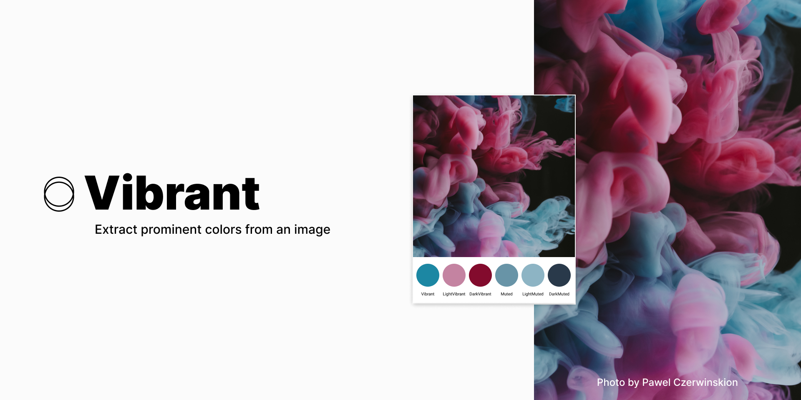

  

# Figma Vibrant Colors
Extract prominent colors from an image.

<!-- [Install on Figma](https://www.figma.com/c/plugin/744725347356614754/Dominant-Color-Toolkit-%F0%9F%8E%A8) -->

## Core
This plugin is based on [Dominant Color Toolkit 🎨](https://www.figma.com/community/plugin/744725347356614754/Dominant-Color-Toolkit-%F0%9F%8E%A8) only it's uses [node-vibrant](https://github.com/Vibrant-Colors/node-vibrant) library to extract vibrant palette (vibrant, lightVibrant, darkVibrant, muted, lightMuted, darkMuted)

## Install
1. `git clone https://github.com/lea37/figma-vibrant.git`
2. `cd figma-vibrant`
3. `npm install`
4. `npm run dev` or `npm run build`

## Use
Go to Plugins > Development > Import plugin from manifest...
Choose the manifest.json at the root of the figma-vibrant folder.
